# EduAI Platform

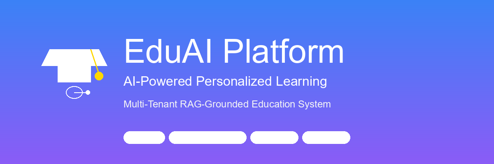

> **AI-Powered Personalized Education System**  
> A multi-tenant, RAG-grounded AI tutor platform that transforms school curricula into private knowledge bases, delivering cited answers to students while empowering teachers with automated workflows and actionable insights.

[](https://www.python.org/)
[](https://www.djangoproject.com/)
[](https://supabase.com/)
[](https://github.com/pgvector/pgvector)
[]()
[]()
[](https://ai-powered-personalized-education-system.onrender.com)

---

## Table of Contents

- [Live Demo](#live-demo)
- [The Problem](#the-problem)
- [Our Solution](#our-solution)
- [Key Features](#key-features)
- [System Architecture](#system-architecture)
- [Technology Stack](#technology-stack)
- [Getting Started](#getting-started)
- [User Guides](#user-guides)
- [Deployment](#deployment)
- [Testing](#testing)
- [Project Structure](#project-structure)
- [Roadmap](#roadmap)
- [Contributing](#contributing)
- [Acknowledgements](#acknowledgements)

---

## Live Demo

**Try the platform now:** [https://ai-powered-personalized-education-system.onrender.com](https://ai-powered-personalized-education-system.onrender.com)

### Demo Accounts

Use these pre-configured accounts to explore different user roles. Password will be provided separately by your instructor.

**Students:**
- `adrian.zimmerman.17@springfield.test`
- `alexis.davis.37@riverside.test`
- `adrian.zimmerman.17@riverside.test`

**Teachers:**
- `andrea.calderon.3@springfield.test`
- `christopher.williams.7@riverside.test`
- `andrea.calderon.3@riverside.test`

**School Administrators:**
- `admin@springfield.test`
- `admin@riverside.test`

> Note: The demo includes two synthetic school tenants (Springfield and Riverside) with complete curriculum data, user profiles, and sample assignments.

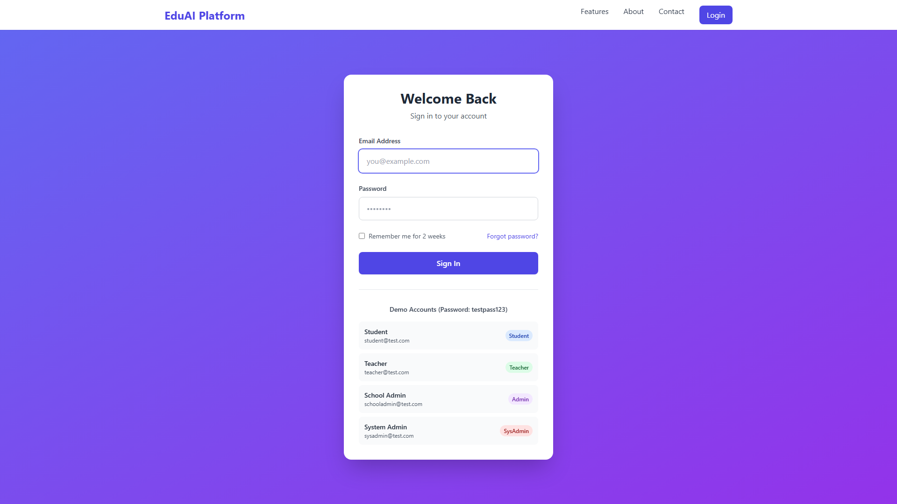

---

## The Problem

### The Education Technology Gap

Modern education faces three critical challenges that existing tools fail to address:

#### 1. AI Hallucination Crisis

Generic LLMs (ChatGPT, Claude, etc.) cheerfully invent quotes from textbooks they have never seen. Students rely on these hallucinated "facts" and fail exams because they cited the wrong formula or concept.

**Impact:** Students lose trust in AI assistance and fall back on rote memorization.

#### 2. Content Customization Challenge

Real schools use specific textbooks - Math Grade 9 by Pearson, not a generic Wikipedia summary. Existing LMS platforms cannot ground AI answers in the actual curriculum materials teachers use.

**Impact:** Teachers waste time fact-checking student work against AI-generated content that does not match their syllabus.

#### 3. Teacher Workflow Fragmentation

Teachers juggle multiple disconnected tools: one for gradebook, another for assignments, a third for analytics. The data exists but the feedback loop is broken.

**Impact:** Hours wasted on manual grading, delayed interventions for struggling students, and no real-time insights into class performance.

### Before vs. After

| Challenge | Without EduAI | With EduAI |
|-----------|--------------|------------|
| AI Accuracy | Hallucinated answers from generic models | Cited answers from school-specific curriculum |
| Content Relevance | Generic knowledge not aligned to syllabus | Grounded in actual textbooks used in class |
| Teacher Time | Manual grading + scattered tools | Auto-grading + unified dashboard |
| Student Insights | Delayed or no performance tracking | Real-time mastery heatmaps and alerts |
| Tenant Isolation | No multi-school support | Complete data isolation per school |

---

## Our Solution

### EduAI Platform: RAG-Grounded Learning Ecosystem

EduAI closes the education technology gap with four integrated pillars:

#### 1. Grounded AI Tutor with Citations

Students chat with an AI tutor that retrieves passages from their school's actual textbooks and answers with clickable citations - no hallucinations, just verifiable sources.

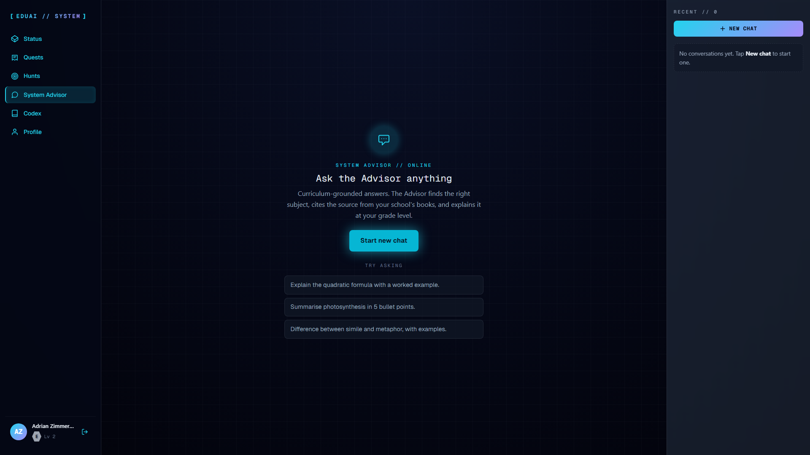

**How it works:**
- Query embedding (384-dim vectors)
- Cosine similarity search with pgvector
- Top-5 relevant chunks returned
- LLM generates answer with [1], [2], [3] citations
- Students click citations to verify sources

#### 2. Comprehensive School Admin Portal

Administrators manage the entire school ecosystem from a unified dashboard with real-time stats, automated alerts, and deep analytics.

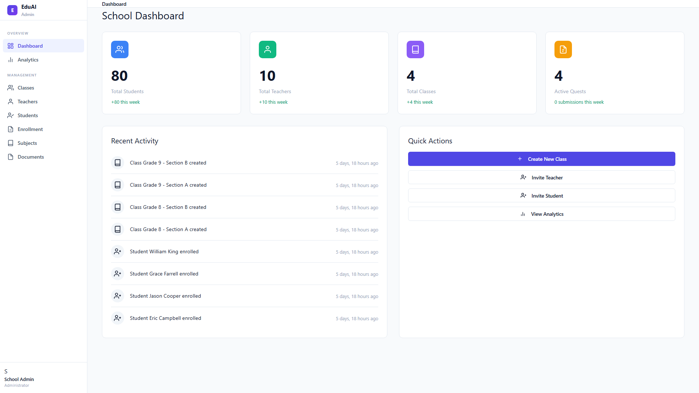

**Features:**
- Dashboard with key metrics (students, teachers, classes, quests)
- Automated alerts (unassigned teachers, unenrolled students, inactive users)
- Analytics: teacher utilization, class performance, subject distribution
- Enrollment management with capacity tracking
- Complete CRUD for classes, subjects, teachers, students, documents

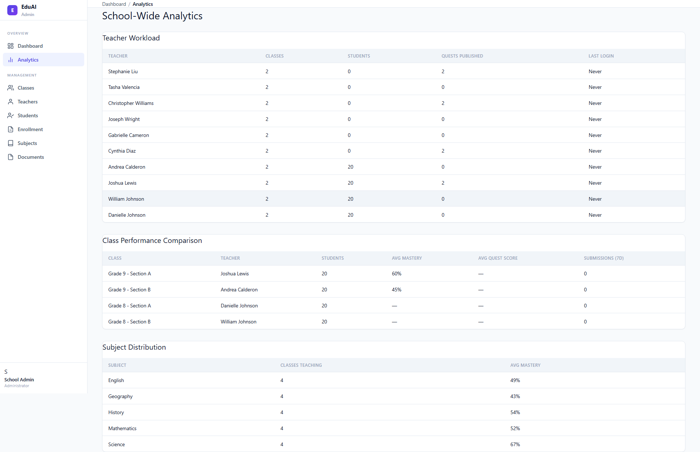

#### 3. Teacher Workflow Automation

Teachers create quests (assignments), track submissions in a gradebook, grade question-by-question, and view insights on struggling students.

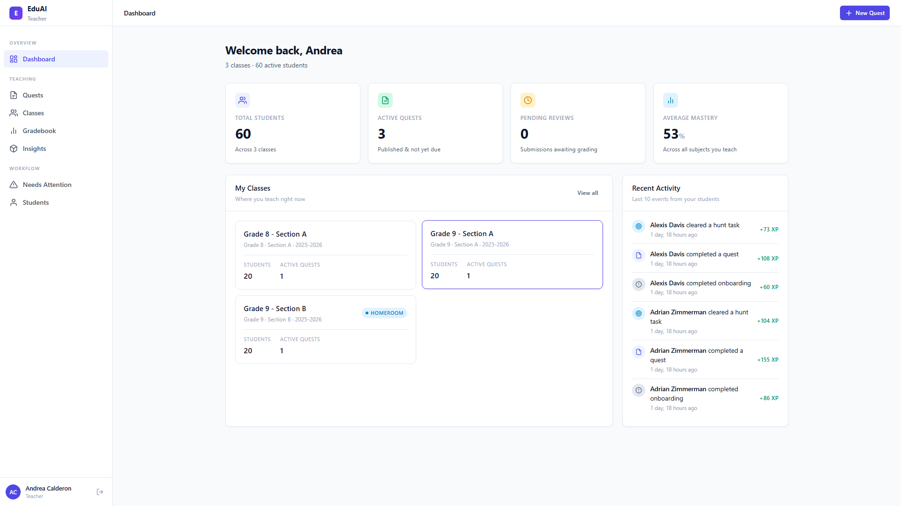

**Capabilities:**
- Quest creation and publishing
- Gradebook with submission tracking
- Question-by-question grading interface
- Insights dashboard: struggling students, top performers, mastery heatmap

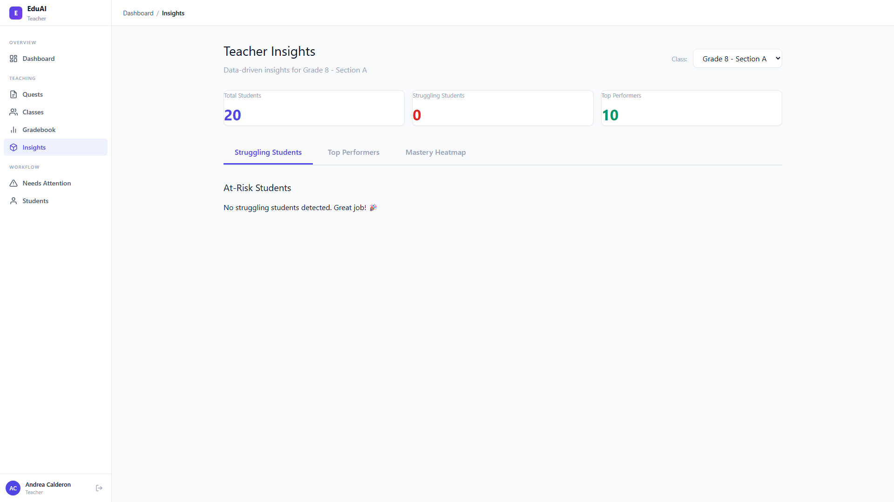

#### 4. Multi-Tenant Architecture

Every school gets an isolated tenant with its own users, curriculum, and embeddings. One school's data can never leak into another's tutor answers.

**Security guarantees:**
- Tenant filter on all queries
- Foreign key cascade for data deletion
- Middleware-enforced tenant resolution
- No cross-tenant vector search

---

## Key Features

### Core Capabilities

- **RAG Pipeline:** Vector search over 384-dim embeddings with HNSW indexing for fast retrieval
- **Multi-Tenancy:** Complete data isolation per school with middleware enforcement
- **Role-Based Access Control (RBAC):** 4 roles - Student, Teacher, School Admin, System Admin
- **Offline Mode:** Fallback to source retrieval when LLM is unavailable (zero token spend)
- **Pluggable Components:** Swap LLM (OpenAI/Azure/Ollama) or embedder (HuggingFace/local) via env vars
- **Runtime Settings:** Admin-editable `AppSetting` table for hot config changes without redeployment
- **REST API:** DRF ViewSets for programmatic access to tutoring sessions and messages
- **Synthetic Data:** 182 demo users, 12 textbooks, 148 embeddings ready to play with

### Teacher Tools

- **Quest System:** Create assignments manually or with AI-generated questions
- **Automated Grading:** MCQ auto-grading with manual review for essays/uploads
- **Gradebook:** Grid view of all assignments with submission status
- **Insights Dashboard:**
  - Struggling students queue (auto-flagged based on risk factors)
  - Top performers leaderboard (sorted by XP, mastery, streak, or quest score)
  - Mastery heatmap (student × subject grid showing proficiency levels)

### Admin Tools

- **Dashboard:** Stats cards, alerts, recent activity feed, quick actions
- **Analytics:** Teacher workload, class performance comparison, subject distribution
- **Enrollment Management:** Unenrolled student tracking, class capacity indicators
- **CRUD Operations:** Manage classes, teachers, students, subjects, documents

---

## System Architecture

### High-Level Overview

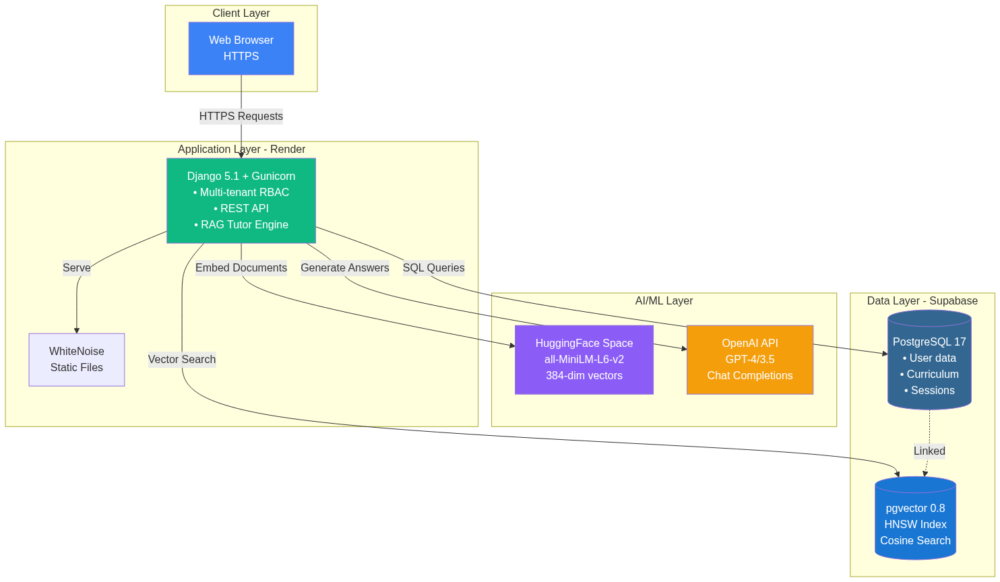

The platform consists of three deployment units:

| Component | Hosting | Purpose |
|-----------|---------|---------|
| **Django Application** | Render (Docker) | Stateless web app with Gunicorn WSGI |
| **PostgreSQL + pgvector** | Supabase | Managed database with vector extension |
| **Embedding Service** | HuggingFace Space | FastAPI microservice for text embeddings |

### RAG Pipeline Flow

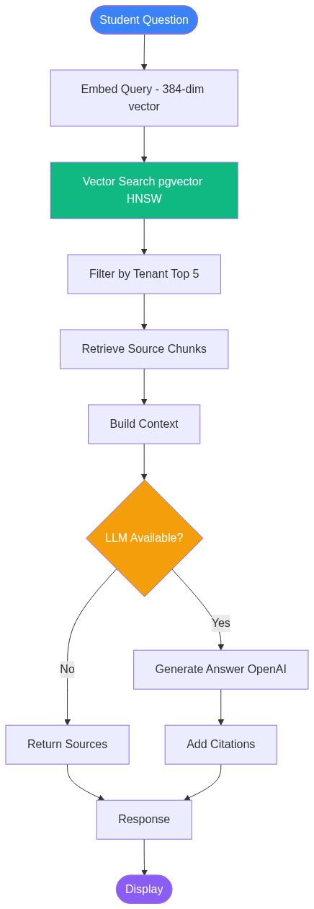

1. Student asks a question
2. Query is embedded into 384-dim vector
3. pgvector performs cosine similarity search (HNSW index)
4. Top-5 chunks filtered by tenant
5. Context built from sources + question
6. LLM generates answer with citations (or falls back to sources if offline)
7. Response returned with clickable source links

### Multi-Tenant Data Isolation

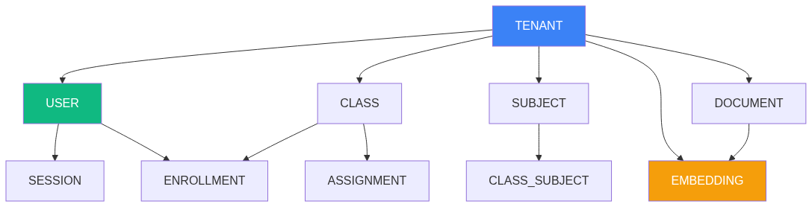

Every domain model inherits from `TenantAwareModel`:
- `tenant_id` foreign key on all tables
- Middleware resolves tenant from user or subdomain
- Queries auto-filtered by tenant
- Vector search scoped to tenant embeddings

### Deployment Topology

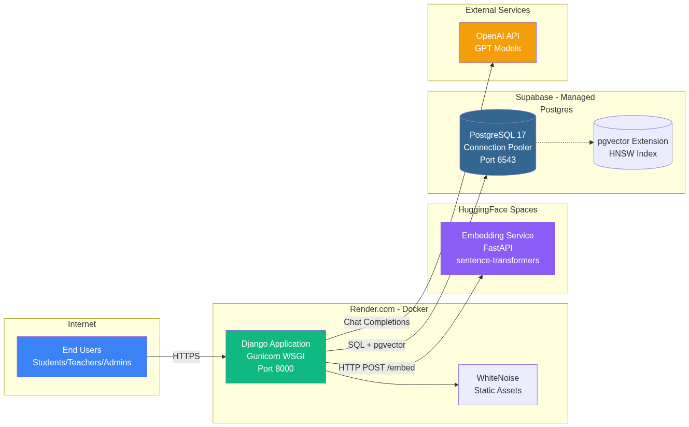

**Production Stack:**
- **Frontend:** Users access via HTTPS
- **Backend:** Django on Render with WhiteNoise for static files
- **AI Layer:** HuggingFace Space for embeddings, OpenAI for completions
- **Data Layer:** Supabase for PostgreSQL with pgvector extension (port 6543 connection pooler)

---

## Technology Stack

### Layered Architecture

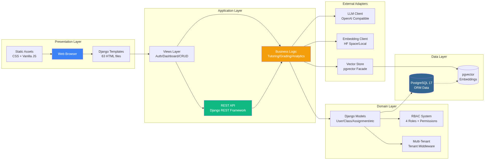

| Layer | Technologies |
|-------|-------------|
| **Presentation** | Django Templates (63 HTML files), Vanilla JavaScript, Tailwind CSS (CDN) |
| **Application** | Django 5.1, Django REST Framework, Gunicorn WSGI |
| **Business Logic** | Tutoring service, Grading engine, Analytics aggregators |
| **Domain** | Django ORM models, RBAC system, Multi-tenant middleware |
| **External Adapters** | OpenAI client, HuggingFace embedder, pgvector facade |
| **Data** | PostgreSQL 17 (Supabase), pgvector 0.8 with HNSW index |

### Core Technologies

| Category | Choice | Why? |
|----------|--------|------|
| **Runtime** | Python 3.12 | Latest stable with type hints |
| **Framework** | Django 5.1 | Mature ORM, admin, auth, batteries included |
| **API** | Django REST Framework | Consistent API responses, serializers, ViewSets |
| **Database** | PostgreSQL 17 | JSONB support, pgvector compatibility |
| **Vector Store** | pgvector 0.8 | Native Postgres extension, HNSW indexing |
| **Embedder** | sentence-transformers/all-MiniLM-L6-v2 | 384-dim, lightweight, accurate |
| **LLM** | OpenAI API | GPT-4/3.5 with chat completions endpoint |
| **Frontend** | Vanilla JS + Tailwind | No build step, fast iteration |
| **Static Files** | WhiteNoise | Compression, caching, no CDN needed |
| **Deployment** | Render + Supabase + HuggingFace | Free tiers, managed services, autoDeploy |

---

## Getting Started

### Prerequisites

- Python 3.12+
- Git
- Internet connection (for shared database setup)

### Quick Start (5 minutes)

This path connects your local app to the shared Supabase database and HuggingFace embedder - no migrations, no seeding, just run.

```bash
# Clone repository
git clone https://github.com/hackdavid/AI-powered-personalized-education-system.git
cd AI-powered-personalized-education-system

# Create virtual environment
python -m venv venv

# Activate virtual environment
venv\Scripts\activate              # Windows
# source venv/bin/activate         # macOS / Linux

# Install dependencies
pip install -r requirements.txt

# Copy environment template
copy .env.local.example .env     # Windows
# cp .env.local.example .env     # macOS / Linux
```

**Configure `.env` file:**

Open `.env` and set these three variables:

| Variable | Value |
|----------|-------|
| `DJANGO_SECRET_KEY` | Run `python -c "import secrets; print(secrets.token_urlsafe(50))"` |
| `DATABASE_URL` | Ask project owner for Supabase pooler URL (port 6543) |
| `DJANGO_DEBUG` | `True` (already set) |

**Start the server:**

```bash
python manage.py runserver
```

Visit `http://127.0.0.1:8000/` and log in with any [demo account](#demo-accounts).

### Local Development (SQLite)

For a completely isolated development environment:

```bash
git clone https://github.com/hackdavid/AI-powered-personalized-education-system.git
cd AI-powered-personalized-education-system
python -m venv venv
source venv/bin/activate  # or venv\Scripts\activate on Windows
pip install -r requirements.txt

cp .env.example .env
# Edit .env: set DJANGO_SECRET_KEY, leave DATABASE_URL blank

python manage.py migrate
python manage.py create_roles
python manage.py bootstrap_app_settings --include-secrets
python manage.py seed_synthetic_data --reset --with-embeddings
python manage.py createsuperuser
python manage.py runserver
```

This creates a local SQLite database with 182 demo users and 148 embeddings.

---

## User Guides

### School Administrator Workflow

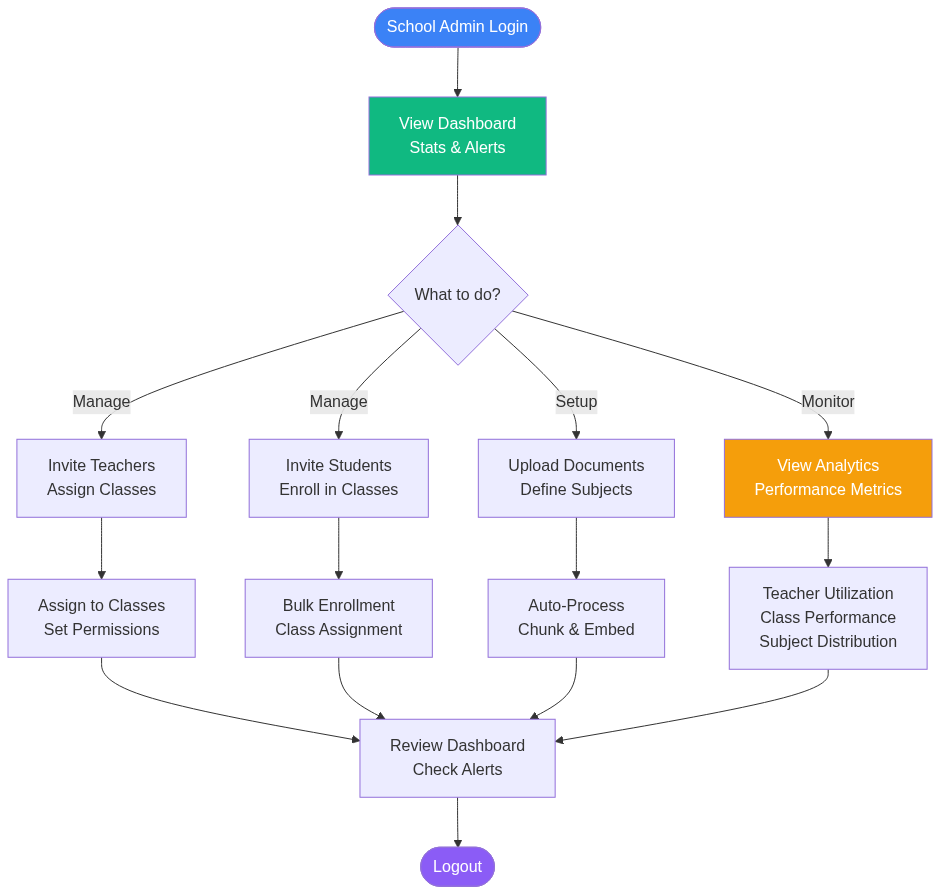

**Key Tasks:**
1. View dashboard with stats and alerts
2. Invite teachers and assign them to classes
3. Invite students and enroll them in classes
4. Upload curriculum documents (auto-chunked and embedded)
5. Monitor analytics: teacher utilization, class performance, subject distribution

**Dashboard Features:**
- Stats cards: Total students, teachers, classes, active quests
- Alerts: Classes without teachers, unenrolled students, inactive teachers
- Recent activity feed
- Quick action buttons


### Teacher Workflow

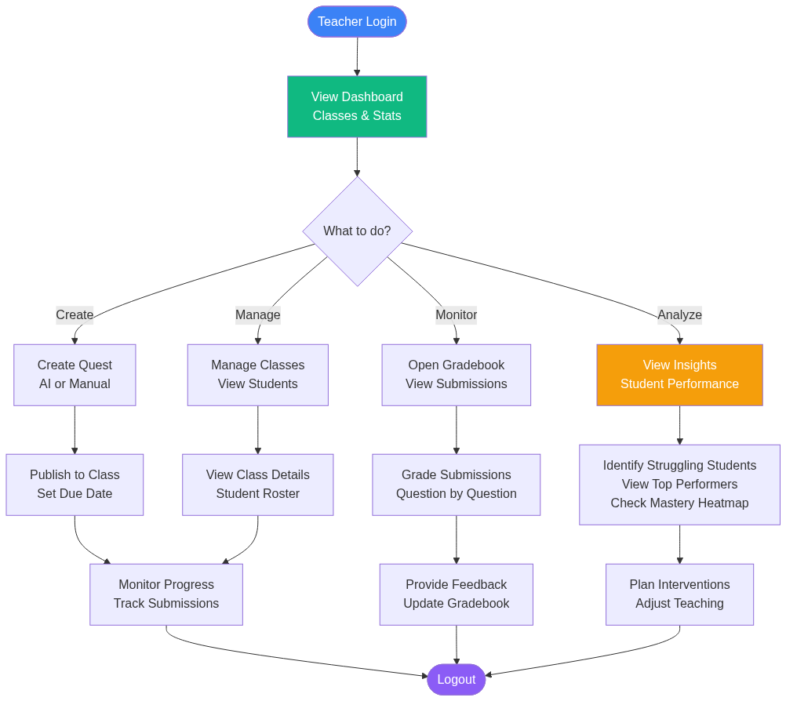

**Key Tasks:**
1. Create quests (assignments) and publish to class
2. View gradebook to track submissions
3. Grade submissions question-by-question
4. Analyze insights: struggling students, top performers, mastery heatmap

**Grading Interface:**
- Question-by-question review
- View student answers alongside correct answers
- Assign partial credit
- Live total calculation

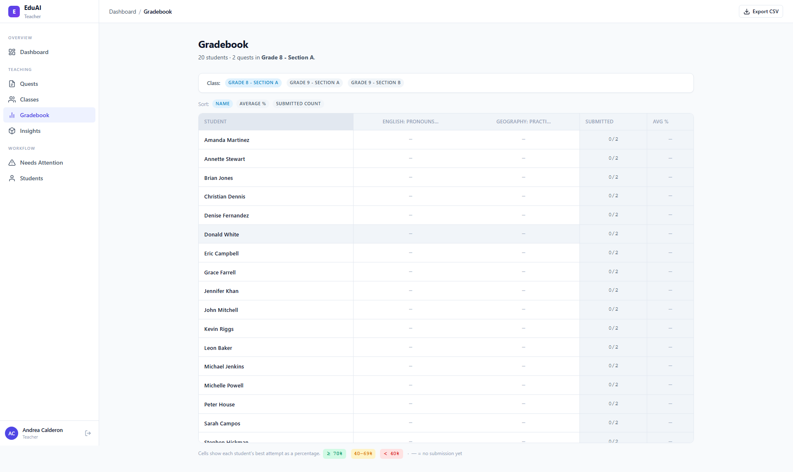

### Student Workflow

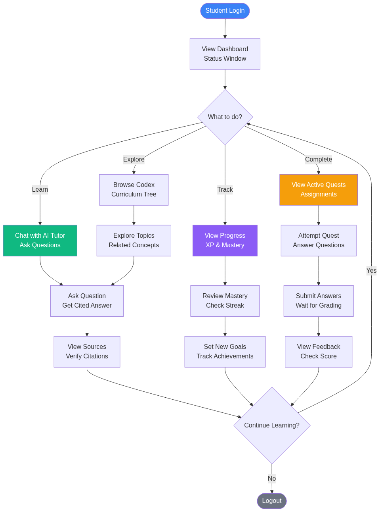

**Key Tasks:**
1. Chat with AI tutor to ask questions about curriculum
2. View active quests (assignments) and submit answers
3. Track progress: XP, mastery levels, streak
4. Explore curriculum via Codex browser

**Tutor Chat Features:**
- Natural language questions
- Cited answers with [1], [2], [3] links
- Click citations to view source documents
- Offline mode returns raw sources when LLM unavailable

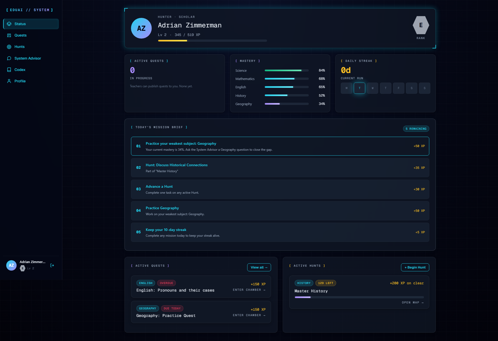

---

## Deployment

### Production Deployment (Render)

The platform deploys to Render with autoDeploy from `main` branch.

**Deployment Flow:**

1. Push to `main` branch
2. Render detects change and triggers build
3. Docker image built from `Dockerfile`
4. Pre-deploy command runs migrations
5. Gunicorn starts on `$PORT`
6. Health check passes at `/health/`
7. Traffic switches to new container

**Required Environment Variables (Render Dashboard):**

| Variable | Value Source |
|----------|-------------|
| `DATABASE_URL` | Supabase connection pooler URL (port 6543) |
| `EMBEDDER_API_KEY` | HuggingFace Space auth token |
| `DJANGO_SECRET_KEY` | Generate with `secrets.token_urlsafe(50)` |
| `DJANGO_DEBUG` | `False` |
| `DJANGO_ALLOWED_HOSTS` | `.onrender.com` |

**Render Blueprint (`render.yaml`):**

```yaml
services:
  - type: web
    name: eduai-platform
    env: docker
    plan: free
    autoDeploy: true
    envVars:
      - key: DJANGO_SECRET_KEY
        generateValue: true
      - key: DATABASE_URL
        sync: false
      - key: EMBEDDER_API_KEY
        sync: false
```

---

## Testing

### Run Tests

```bash
python manage.py test apps
```

**Test Coverage:**

| Test Suite | Tests | Coverage |
|------------|-------|----------|
| Seeding | 5 | Synthetic data, tenant isolation |
| Tutoring | 16 | RAG pipeline, DRF API, RBAC |
| Embeddings | 13 | Remote service, retries, errors |
| pgvector | 17 | Add/search/delete, tenant scoping |
| AppSetting | 12 | Runtime config, overrides |
| Teacher Grading | 15 | Grading workflow, validation |
| Teacher Insights | 21 | Struggling students, heatmap |
| School Admin | 27 | Dashboard, analytics, enrollment |

**Total: 126 tests passing**

Tests mock the LLM and embedder so no network access required.

---

## Project Structure

```
eduai_platform/
├── manage.py
├── requirements.txt              # Single requirements file
├── .env.example                  # Full env var reference
├── .env.local.example            # Quick start template
├── Dockerfile                    # Production runtime
├── render.yaml                   # Render deployment blueprint
│
├── config/
│   ├── settings.py               # Single settings file (DEBUG flag toggles dev/prod)
│   └── urls.py                   # / /auth/* /school-admin/* /student/* /teacher/* /api/v1/* /admin/ /health/
│
├── apps/
│   ├── core/                     # Base models, middleware, decorators, APIResponse, AppSetting, /health
│   ├── accounts/                 # User, Role, Permission, Tenant; auth + RBAC services
│   ├── service/                  # Domain models + services + DRF API
│   │   ├── models/               # Subject, Class, Document, ContentNode, ContentEmbedding, TutoringSession, ChatMessage
│   │   ├── services/             # tutoring, ingestion, seeding, assessments, grading
│   │   └── api/                  # DRF ViewSets (TutoringSession + nested messages)
│   └── web/                      # Presentation layer: views, forms, templates, URLs
│       └── views/{auth, dashboards, school_admin, student, teacher}
│
├── clients/                      # External adapters (NOT a Django app)
│   ├── llm/                      # OpenAI-compatible client
│   ├── embeddings/               # Remote HF Space + local sentence-transformers fallback
│   └── vector_store/             # pgvector client facade
│
├── frontend/
│   ├── static/                   # CSS, JS (core utilities + per-page bundles)
│   └── templates/                # base, components, dashboards, auth, school_admin, student, teacher
│
├── fixtures/synthetic_books/     # 6 hand-authored YAML textbooks
├── docs/                         # Documentation + diagrams + images
└── scripts/                      # Utility scripts (screenshots, hero banner, Mermaid conversion)
```

**Architecture Principle:** Plumbing → core, Who → accounts, What → service, Screens → web, External → clients

---

## Roadmap

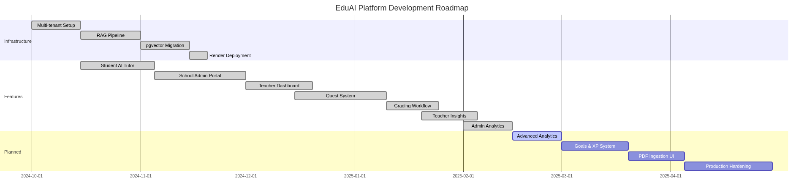

### Completed Features

- Multi-tenant setup with tenant isolation
- RAG pipeline with pgvector and cited answers
- Student AI tutor with chat interface
- School admin portal with CRUD operations
- Teacher dashboard with quest system
- Grading workflow (auto-grading + manual review)
- Teacher insights (struggling students, top performers, mastery heatmap)
- Admin analytics (teacher utilization, class performance, enrollment management)

### Planned Features

- **Advanced Analytics** (Q1 2025)
  - Predictive student performance models
  - Curriculum gap analysis
  - Teacher effectiveness metrics

- **Goals & XP System** (Q1-Q2 2025)
  - Gamified progression (anime-style "solo leveling")
  - Achievement badges
  - Leaderboards

- **PDF Ingestion UI** (Q2 2025)
  - Drag-and-drop PDF upload
  - Auto-chunking and embedding
  - Document management interface

- **Production Hardening** (Q2 2025)
  - Celery task queue
  - Redis caching
  - S3 file storage
  - End-to-end tests with Playwright
  - GitHub Actions CI/CD

---

## Contributing

1. Pick an item from the [Roadmap](#roadmap)
2. Branch off `main`, push to GitHub, open a PR
3. Keep tests green: `python manage.py test apps`

**Code Standards:**
- Follow Django conventions
- Add docstrings to public functions
- Write tests for new features
- Keep README in sync with code

---

## Acknowledgements

- [pgvector](https://github.com/pgvector/pgvector) - Postgres extension for vector search
- [sentence-transformers](https://www.sbert.net/) - all-MiniLM-L6-v2 embedding model
- [Supabase](https://supabase.com/) - Managed Postgres + pgvector
- [HuggingFace Spaces](https://huggingface.co/spaces) - Free CPU host for embedding service
- [Render](https://render.com/) - autoDeploy + Docker runtime
- Roehampton **CMP-L044 (AI Engineering)** course staff and group members

---

## License

Academic project for CMP-L044 (AI Engineering) at Roehampton University. Not yet open source - please do not redistribute without permission.

---

**Built with dedication by the EduAI Team | 2026**
