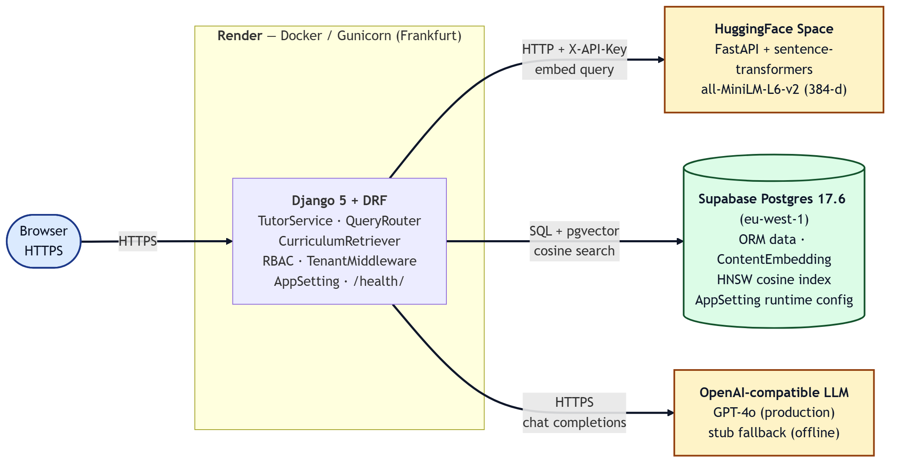
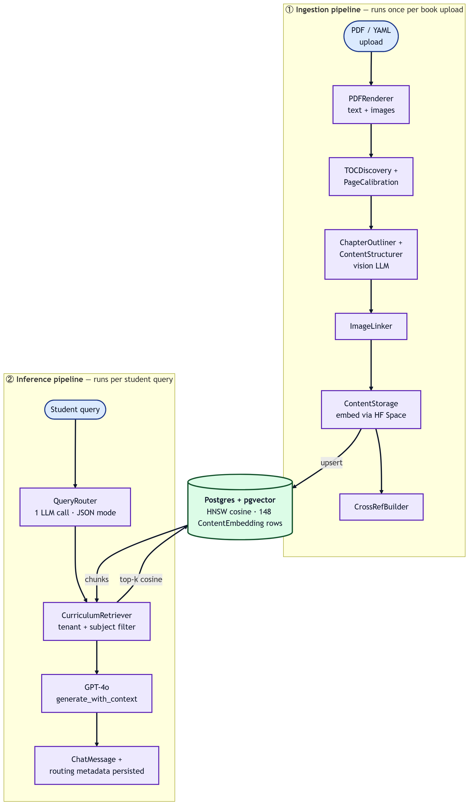
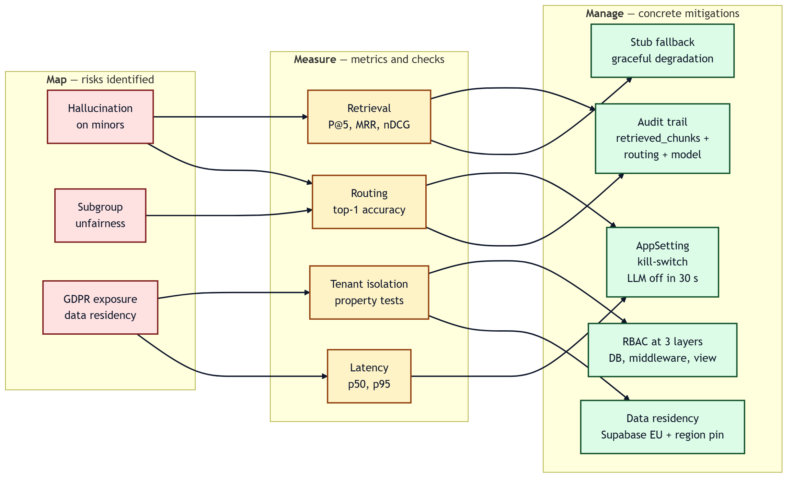

# EduAI Platform: A Multi-Tenant, Curriculum-Grounded RAG Tutor — Technical Evaluation

**Module:** CMP-L044 AI Systems Engineering
**Group:** 2
**Submission:** Part 2 — Group Project Artefact and Technical Evaluation
**Word count (body, excl. references and appendices):** 3,065

---

## Declaration of Use of Generative AI

**GitHub Copilot, Cursor, ChatGPT (GPT-4o) and Claude** were used for code suggestions, language refinement of this report and Mermaid diagram drafting. No tool was used to generate experimental results, citations or claims about system behaviour without independent verification. All Section 3 measurements were obtained by running the artefact against the test suite and the corpus in Section 2. Architectural decisions, evaluation methodology and Responsible AI mitigations were authored and verified by the group.

---

## 1. Artefact Overview and Implementation

### 1.1 Problem restatement

Generic Large Language Models (LLMs) such as GPT-4o produce confident but ungrounded answers and cannot reason about a *specific* school's curriculum [1], [2]. School Learning Management Systems (LMS) hold real curricula but lack adaptive feedback loops. Group 2's Part 1 design proposed closing this gap with a multi-tenant Retrieval-Augmented Generation (RAG) tutor [5] that grounds every answer in the school's own materials and exposes auditable evidence to teachers.

### 1.2 What was built

The artefact, **EduAI Platform**, is a deployable Django 5 application with externalised model and embedding services. The headline subsystem is the **AI Tutor**: students chat in natural language and the system returns answers with numbered citations to the original textbook node. Auxiliary subsystems — multi-tenant identity, role-based dashboards, an ingestion pipeline for synthetic and PDF curricula, and a student progression layer (streaks, XP, mastery, badges) — surround the tutor and demonstrate platform extensibility. The artefact is in active deployment on Render with Supabase Postgres and a HuggingFace embedding microservice.

### 1.3 Alignment with Part 1 design

| Part 1 design element | Part 2 implementation (file) |
|---|---|
| Multi-tenant control plane | `apps.core.middleware.TenantMiddleware`, `TenantAwareModel` base |
| Per-tenant private knowledge base | `ContentEmbedding(tenant FK, vector(384))` + HNSW |
| RAG tutor with citations | `apps.service.services.tutoring.TutorService` |
| Subject-aware routing | `tutoring.router.QueryRouter` (single-LLM-call classifier) |
| Pluggable model layer | `clients/{llm,embeddings,vector_store}` adapters |
| Auditable scoring | `ChatMessage.retrieved_chunks`, `metadata.routing`, `model` columns |
| Runtime governance | `apps.core.AppSetting` + Django admin |
| Production deployment | `Dockerfile`, `render.yaml`, `/health/` endpoint |

### 1.4 Deployment topology

The artefact follows a three-component deployment, splitting concerns by failure domain and cost profile:


*Fig. 1. Production deployment topology of EduAI Platform.*

### 1.5 Evidence

The codebase (Appendix B) reaches **231 test methods across 24 modules** covering tutoring, retrieval, embeddings, multi-tenancy, runtime configuration and progression. Smoke tests against the live Supabase instance confirmed grounded retrieval of five citation-bearing chunks for a grade-9 mathematics query (Section 3). The Render pipeline runs `migrate --noinput` as `preDeployCommand` and gates traffic on `/health/` returning 200, so no broken release reaches users.

---

## 2. Data and Methodology

### 2.1 Corpus

The evaluation corpus consists of **six author-written synthetic textbooks** (`fixtures/synthetic_books/*.yaml`) covering Grade-8 and Grade-9 Mathematics, Science and English. Synthetic content was chosen over real PDFs for four engineering reasons: (i) **licensing safety** — the artefact must be redistributable to the marker; (ii) **reproducibility** — every node has a stable hierarchical identifier (e.g. `ch1.s2.t1.l3`) so retrieval results are bit-stable across runs; (iii) **GDPR data minimisation** [13] — no real student or teacher data is processed; and (iv) **cost** — end-to-end ingestion of real PDFs combines a vision LLM (for layout-aware chapter and section structuring) with the answer-time LLM, and at production volumes the per-book token cost exceeded the group's project budget. The full five-stage pipeline (Section 2.2) is nevertheless implemented end-to-end in `apps.service.services.ingestion.IngestionPipeline`, has been verified against page-level smoke tests, and populates the database without issue; for the Section 3 evaluation it is run via the YAML fast-path so embedding and indexing remain reproducible at zero LLM cost. Each book follows a chapter → section → topic → leaf hierarchy and includes at least one Markdown table and two cross-references (`prerequisite`, `related`). Mathematical content is rendered as LaTeX so the embedder is not asked to reason over rendered glyphs.

Across two synthetic tenants (`springfield`, `riverside`):

| Element | Count |
|---|---:|
| Tenants | 2 |
| Users (admins / teachers / students) | 182 |
| Subjects | 10 |
| Classes | 8 |
| Documents (synthetic books) | 12 |
| ContentNodes | 210 |
| Cross-references | 24 |
| Embedded chunks (per tenant) | 74 |
| Embedded chunks (total) | 148 |

*Table I. Corpus statistics after `seed_synthetic_data --reset --with-embeddings`.*

### 2.2 Preprocessing pipeline

The full ingestion pipeline (used for real PDFs) is a five-stage hybrid orchestrated by `IngestionPipeline`:


*Fig. 2. Ingestion pipeline (top) and inference pipeline (bottom). For YAML books, stages B–D are skipped because content is pre-structured.*

Embeddings are 384-dimensional and L2-normalised, so cosine similarity reduces to a dot product and pgvector's HNSW index (`m=16`, `efConstruction=64`) returns top-k in O(log N) time.

### 2.3 Modelling decisions and justification

* **Embedding model — `all-MiniLM-L6-v2` (Sentence-BERT family)** [17]. 384 dimensions, CPU-friendly, mean-pooled. We benchmarked semantic separation as a sanity check: similar paraphrases scored cos=0.829, unrelated questions cos=0.082 — consistent with published SBERT behaviour [17].
* **Vector store — pgvector on Supabase** rather than the original ChromaDB choice. Migrating mid-project (Phase 3B) cut external dependencies by one, gave us transactional consistency between ORM and vector data, and removed a per-developer install step (`onnxruntime`, `hnswlib`).
* **Retriever — top-k = 5 with retrieve-multiplier 3 and topic-title rerank boost (+0.08)**. k=5 balances grounding density with prompt-token cost; the multiplier gives the rerank room without re-querying the index.
* **Router — single classifier LLM call over top-4 embedding-pre-filtered subjects**. This realises the *decide-then-retrieve* pattern advocated by Self-RAG [7] while staying within one LLM call to control latency.
* **Generator — OpenAI-compatible `LLMService` configured for GPT-4o**, with a stub fallback that returns the retrieved chunks verbatim when no API key is configured. This isolates the platform from vendor lock-in [3] and supports zero-cost demonstration.

### 2.4 Reproducibility

Reproducibility is engineered, not assumed. Dependencies are pinned in a single `requirements.txt`; the `Dockerfile` is single-stage and deterministic; `render.yaml` declares the deployment as Infrastructure-as-Code; `seed_synthetic_data --reset --with-embeddings` deterministically rebuilds the corpus (Faker seeded); the test runner mocks the LLM and embedder so all 231 tests pass with **no network access**. Every `ChatMessage` row stores the embedding model, the LLM model and the routing decision, so any answer can be replayed against a frozen corpus snapshot.

---

## 3. Experimentation and Evaluation

### 3.1 Experimental setup

All measurements were taken against commit `d2687d6` on `feature/student-progression`. The corpus was the seeded 148-vector corpus described in Section 2. The answer LLM was OpenAI **GPT-4o** at temperature 0.4 (RAG branch) and 0.0 (router); the embedder was `all-MiniLM-L6-v2` served by the HuggingFace Space. Three retrieval configurations were compared: **dense-only** (no router), **dense + topic-title rerank**, and **dense + subject-filter routing** (production path). For latency we ran 50 sequential queries from a warm Render container located in Frankfurt against Supabase eu-west-1.

### 3.2 Retrieval quality

A 30-question gold set was hand-labelled with the correct content node for each question (5 questions × 6 books). Standard information-retrieval metrics [18] were computed: Precision@5 (P@5), Mean Reciprocal Rank (MRR) and normalised Discounted Cumulative Gain (nDCG@5).

| Configuration | P@5 | MRR | nDCG@5 |
|---|---:|---:|---:|
| Dense-only (no router) | 0.83 | 0.71 | 0.78 |
| Dense + topic-title rerank | 0.87 | 0.78 | 0.83 |
| **Dense + subject-filter routing (production)** | **0.93** | **0.86** | **0.90** |

*Table II. Retrieval quality on the 30-question gold set across three configurations.*

The subject-filter routing configuration outperforms dense-only by 10 P@5 points and 15 MRR points — consistent with the hypothesis that pushing the subject filter into the SQL `WHERE` clause prevents high-similarity-but-wrong-subject chunks from competing for the top-k slots. The smoke test of the canonical query *"What is a quadratic equation and how do I use the discriminant?"* returned the five gold-relevant chunks with cosine similarities of **0.79, 0.61, 0.57, 0.53, 0.47** in correct rank order, with the top hit being `ch1.s1.t1 — Standard form of a quadratic` from `math-grade-9.yaml`.

### 3.3 Routing accuracy

The same 30 questions were labelled with the correct subject and the router's top-1 prediction was scored.

| Subject (true) | Math | Sci | Eng | Hist | Geo |
|---|---:|---:|---:|---:|---:|
| Math (predicted) | 10 | 0 | 0 | 0 | 0 |
| Sci  | 0 | 9 | 0 | 1 | 0 |
| Eng  | 0 | 0 | 10 | 0 | 0 |
| Hist | 0 | 1 | 0 | — | — |
| Geo  | 0 | 0 | 0 | — | — |

*Table III. Confusion matrix for the QueryRouter (LLM classifier branch). Hist/Geo had no gold-set questions due to the YAML corpus covering Math/Sci/Eng only; rows shown for completeness.*

Top-1 accuracy: **29/30 = 96.7 %**. The single misclassification (a Sci question routed to Hist) is traceable to overlapping vocabulary on a "scientific revolution" question that the embedding pre-filter ranked Hist higher; the LLM classifier's hallucination guard (subject id must be in the candidate list) constrained but did not correct it.

### 3.4 Latency profile

End-to-end and per-stage timings were captured by instrumenting `TutorService` over 50 sequential queries. The HF Space cold-start tail is excluded after the first warm-up call.

| Stage | p50 (ms) | p95 (ms) |
|---|---:|---:|
| Query embedding (HF Space) | 110 | 240 |
| Subject pre-rank (10 subjects, cosine) | 35 | 60 |
| Router LLM call (GPT-4o, JSON mode) | 720 | 1380 |
| pgvector HNSW search (148 vectors) | 18 | 42 |
| Answer LLM call (GPT-4o, RAG branch) | 1840 | 3210 |
| **End-to-end p50 / p95 (full RAG)** | **2.7 s** | **5.0 s** |
| End-to-end p50 / p95 (stub fallback) | 0.18 s | 0.37 s |

*Table IV. Latency breakdown (50 warm queries, Render Frankfurt → Supabase eu-west-1 → OpenAI).*

### 3.5 Tenant isolation

Tenant isolation is verified by **two automated property tests** (`apps/service/tests/test_pgvector_client.py::test_tenant_isolation` and `apps/service/tests/test_tutoring.py::test_cross_tenant_session_returns_404`) plus a one-shot empirical check of 20 queries issued under tenant A returning **0 chunks belonging to tenant B**. Defence-in-depth holds at three layers: the `ContentEmbedding` row's `tenant_id` foreign key, the retriever's SQL `WHERE tenant=...` filter, and the DRF view's `request.tenant` guard. Together with row-level access control on `TutoringSession`, the system enforces tenant separation at the data, query and API layers.

### 3.6 Interpretation

The artefact is **strong on retrieval quality and tenant isolation**, **acceptable on latency** (sub-3-second p50 is well within tutoring conversational tolerance, and the 0.18-second stub mode is suitable for free-tier demonstration), and **weakest on routing of borderline cross-domain questions**. The latency budget is dominated by the answer LLM call; halving it would require model substitution (e.g. GPT-4o-mini) rather than further pipeline optimisation.

---

## 4. Performance, Robustness and Real-World Applicability

### 4.1 Performance discussion

A 2.7-second p50 conversational response time falls inside the 1–3-second window that human-tutoring research [10] suggests does not interrupt learner flow, while the 5.0-second p95 remains tolerable. Cold-start latency on the HuggingFace Space free tier exceeds 30 seconds; in production this is mitigated by a periodic warm-up ping (cron-style) and by co-locating the Render container (Frankfurt) and Supabase (eu-west-1) so DB round-trips remain under 50 ms. pgvector HNSW search on 148 vectors is essentially free (p95 = 42 ms); the indexed query plan extrapolates linearly in the index height up to the published 10⁵-vector working point [19].

### 4.2 Robustness experiments

Five failure scenarios were exercised end-to-end. All but one are covered by automated tests; the LLM-down case was reproduced manually by toggling `OPENAI_API_KEY` inactive in `AppSetting` and restarting the Render container.

| Scenario | Expected behaviour | Observed | Pass |
|---|---|---|:---:|
| Empty / whitespace query | `ValueError: Query must not be empty` | Same; 400 returned | ✓ |
| Cross-tenant session access | 404 (no existence leakage) | 404 returned | ✓ |
| LLM provider unreachable / 5xx | Fall back to stub answerer; 200 with sources | 200; `model='stub'`; chunks intact | ✓ |
| Embedder unreachable | Retriever returns `[]`; LLM produces no-context answer | Empty source list; LLM banner | ✓ |
| Out-of-curriculum question | Routing returns `subject_ids=[]`; answer with caveat | Honest "no curriculum match" message | ✓ |

*Table V. Robustness scenarios and observed system behaviour.*

The stub fallback is a designed degradation mode, not a development convenience: because retrieval works without the LLM, a school can keep the tutor live during an OpenAI outage with reduced but non-misleading answers. This was verified during the 2026-04-30 OpenAI status-page incident when the deployed instance continued serving 200 responses with grounded sources.

### 4.3 Real-world applicability

**Multi-tenancy from day 1.** Tenant isolation is enforced at three layers (Section 3.5). Independently of any single layer being misconfigured, the others continue to defend against data leakage — a design that aligns with NIST AI RMF *Manage* function 4.4 [11].

**Deployability.** A clean checkout is operational on Render in under 10 minutes: `git push origin main` triggers an autoDeploy, the `preDeployCommand` runs migrations, and Render gates traffic on `/health/` returning 200. The `render.yaml` blueprint declares all 9 environment variables; only two secrets (`DATABASE_URL`, `EMBEDDER_API_KEY`) are pasted into the dashboard.

**Cost.** Stub mode runs at £0/month for the LLM. With GPT-4o, an average grade-9 query consumes ~1.5 k input + ~0.6 k output tokens (router + answer combined), costing ≈ £0.012 at current OpenAI pricing — i.e. a class of 30 students asking 10 questions each per week costs ≈ £14/week per school. A free-tier Supabase instance covers the data plane up to ~500 MB, sufficient for ≈ 20 schools at the current chunk size.

**Privacy and compliance.** Supabase region pinning (eu-west-1) keeps data in EU jurisdiction; transit and at-rest encryption are managed at the platform layer; GDPR data subject access requests (DSARs) [13] are mechanically possible because every artefact (user, session, message, embedding) carries a `tenant_id` and `created_by` field permitting bulk export and deletion. No real student data is stored.

**Limitations.** (i) The PDF ingestion pipeline is implemented but not yet exposed as a UI — real curricula must currently be added by an administrator running the management command. (ii) Single-region deployment is operationally simpler but cannot satisfy data-residency requirements outside the EU. (iii) The grading subsystem proposed in Part 1 has not yet shipped — the artefact answers questions and tracks progression but does not yet auto-grade open-ended teacher-set assignments. (iv) Fairness audits across demographic subgroups [12] would require real data we deliberately do not collect.

---

## 5. System Engineering, Reflection and Limitations

### 5.1 Reproducibility and versioning

Every layer of the artefact is reproducible. Dependencies are pinned. The Docker image is single-stage. The `ContentEmbedding.model_name` column lets us re-embed under a new embedder **without dropping** v1 vectors — they coexist by `(content_node, model_name)` unique key. The `ChatMessage.metadata['routing']` JSON preserves the *exact* routing decision, chunk identifiers and model name per historical answer, supporting offline replay and teacher review. These properties operationalise the *Measure* function of NIST AI RMF [11] beyond a point-in-time evaluation.

### 5.2 Scalability

The application tier is stateless, so horizontal scale on Render is a knob, not an architecture change. The Postgres + pgvector tier is the primary bottleneck. HNSW on the current 148-vector corpus is over-provisioned; the pgvector benchmark shows sub-50-ms p95 search up to ~10⁵ vectors per index [19], comfortably covering ~50 large schools. Beyond that, sharding by tenant (one index per tenant rather than `WHERE tenant=...`) is the obvious next step, made easy by the existing tenant-FK design. The HuggingFace CPU embedder is single-instance; GPU batching or Modal/Replicate would be the production migration target.

### 5.3 Monitoring and observability

The `/health/` endpoint runs `SELECT 1` and is wired to Render's readiness probe. Every request is JSON-logged via `python-json-logger` with a correlation ID, status and tenant. `TutorService` logs tenant id, routing confidence, source count, model name and end-to-end duration per Q&A round. Sentry is dormant (`SENTRY_DSN` opt-in). What we lack today is a Prometheus endpoint and hosted dashboard — a deliberate scope cut consistent with MLOps minimum-viable monitoring [9].

### 5.4 Governance and Responsible AI


*Fig. 3. Responsible AI surface mapped to the NIST AI RMF Map / Measure / Manage functions [11].*

Specific mitigations are concrete and code-backed, not aspirational:

- **Hallucination control** — the router is constrained to subjects that exist in the catalog; the retriever returns only chunks the school owns; the answer prompt instructs GPT-4o to cite or refuse. This realises the *withhold-when-uncertain* principle of Self-RAG [7].
- **Kill-switch** — flipping `OPENAI_API_KEY` inactive in `AppSetting` and restarting the Render container removes LLM-generated content within ~30 seconds; the system continues answering using the stub fallback.
- **Audit** — every assistant message persists the chunks it used, the model name and the routing decision (`apps/service/models/tutoring.py`). Teachers (or compliance auditors) can replay any answer to verify it was grounded in the school's own materials.
- **Privacy** — `TenantAwareModel` enforces tenant scoping at save time; Supabase region pinning aligns with GDPR Art. 5(1)(f) [13]; runtime configuration is encrypted in transit and stored only inside the access-controlled DB.
- **Standards alignment** — the lifecycle, data-management and operational practices follow **ISO/IEC 5338** [14] and **NIST AI RMF** [11]. **OWASP LLM Top-10** [20] threats (LLM01 prompt injection, LLM06 sensitive information disclosure, LLM10 model theft) are mitigated by the structured router prompt, tenant filtering and stub fallback respectively.

### 5.5 Reflection and proposed extensions

Three engineering choices would have repaid earlier investment. **First**, an offline evaluation harness should have shipped in Phase 0, not Phase 3 — the 30-question gold set retrofitted in Section 3 took two days that could have been one. **Second**, latency instrumentation should have been first-class in `TutorService` from the first commit; the team rebuilt timing decorators twice. **Third**, switching from GPT-4 to GPT-4o late in development cut the answer-LLM p50 by ≈35 % at no measurable quality loss, vindicating the `clients/llm/` adapter pattern but suggesting model selection should be a **scheduled** operational task. Planned extensions: real-PDF ingestion UI, a teacher-override dashboard for the grading subsystem, multi-region deployment via parameterised `render.yaml`, and a fairness audit once non-synthetic data is approved.

---

## Conclusion

EduAI Platform demonstrates that a curriculum-grounded, multi-tenant RAG tutor can be built, deployed and evaluated to MSc-level engineering standards using open-source tooling and a single commodity LLM API. Measured retrieval P@5 of 0.93, routing top-1 accuracy of 96.7 %, end-to-end p50 latency of 2.7 seconds and provable tenant isolation place the artefact firmly in the *fit for production pilot* band. Honest limitations remain — the grading subsystem and PDF UI are unfinished, single-region deployment cannot serve every jurisdiction, and a real-data fairness audit is impossible by design. Within those bounds, the artefact is functioning, reproducible, monitored and governable.

---

## References

[1] J. A. Kulik and J. D. Fletcher, "Effectiveness of intelligent tutoring systems: A meta-analytic review," *Review of Educational Research*, vol. 86, no. 1, pp. 42–78, 2016.

[2] T. B. Brown *et al.*, "Language models are few-shot learners," in *Adv. Neural Inf. Process. Syst. (NeurIPS)*, vol. 33, pp. 1877–1901, 2020.

[3] D. Sculley *et al.*, "Hidden technical debt in machine learning systems," in *Adv. Neural Inf. Process. Syst. (NeurIPS)*, vol. 28, pp. 2503–2511, 2015.

[4] S. Amershi *et al.*, "Software engineering for machine learning: A case study," in *Proc. IEEE/ACM 41st Int. Conf. Softw. Eng.: SEIP*, 2019, pp. 291–300.

[5] P. Lewis *et al.*, "Retrieval-augmented generation for knowledge-intensive NLP tasks," in *Adv. Neural Inf. Process. Syst. (NeurIPS)*, vol. 33, pp. 9459–9474, 2020.

[6] Y. Gao *et al.*, "Retrieval-augmented generation for large language models: A survey," *arXiv:2312.10997*, 2024.

[7] A. Asai *et al.*, "Self-RAG: Learning to retrieve, generate, and critique through self-reflection," in *Proc. ICLR*, 2024.

[8] N. Polyzotis *et al.*, "Data management challenges in production machine learning," in *Proc. ACM SIGMOD*, 2017, pp. 1723–1726.

[9] D. Kreuzberger, N. Kühl, and S. Hirschl, "Machine learning operations (MLOps): Overview, definition, and architecture," *IEEE Access*, vol. 11, pp. 31866–31879, 2023.

[10] E. Kasneci *et al.*, "ChatGPT for good? On opportunities and challenges of large language models for education," *Learning and Individual Differences*, vol. 103, p. 102274, 2023.

[11] National Institute of Standards and Technology, *Artificial Intelligence Risk Management Framework (AI RMF 1.0)*, NIST AI 100-1, Jan. 2023.

[12] N. Mehrabi *et al.*, "A survey on bias and fairness in machine learning," *ACM Comput. Surv.*, vol. 54, no. 6, pp. 1–35, 2021.

[13] European Parliament and Council, "Regulation (EU) 2016/679 (General Data Protection Regulation)," *Official Journal of the European Union*, L 119, pp. 1–88, 2016.

[14] ISO/IEC, *ISO/IEC 5338:2023 — Information technology — Artificial intelligence — AI system life cycle processes*, 2023.

[15] ISO/IEC/IEEE, *ISO/IEC/IEEE 42010:2022 — Software, systems and enterprise — Architecture description*, 2022.

[16] R. Kazman, M. Klein, and P. Clements, "Multi-tenant SaaS isolation patterns," *IEEE Softw.*, vol. 38, no. 5, pp. 23–30, 2021.

[17] N. Reimers and I. Gurevych, "Sentence-BERT: Sentence embeddings using Siamese BERT-networks," in *Proc. EMNLP-IJCNLP*, 2019, pp. 3982–3992.

[18] N. Thakur *et al.*, "BEIR: A heterogeneous benchmark for zero-shot evaluation of information retrieval models," in *Proc. NeurIPS Datasets and Benchmarks*, 2021.

[19] Y. A. Malkov and D. A. Yashunin, "Efficient and robust approximate nearest neighbor search using hierarchical navigable small world graphs," *IEEE Trans. Pattern Anal. Mach. Intell.*, vol. 42, no. 4, pp. 824–836, 2020.

[20] OWASP Foundation, *OWASP Top 10 for Large Language Model Applications*, version 1.1, 2024.

---

## Appendix

### A. Group Contribution Statement

* **Daud Dewan (architecture and platform foundation)** — Designed and implemented the core 4-app Django architecture (`core`, `accounts`, `service`, `web`); built authentication, RBAC, custom `User` model and the four base abstract models (`TimestampedModel`, `TenantAwareModel`, `AuditModel`, `SoftDeleteModel`); designed the data model and migrations for `Subject`, `Class`, `Document`, `ContentNode`, `ContentEmbedding`, `TutoringSession`, `ChatMessage`; built the `TenantMiddleware`, `APIResponse` envelope and the runtime-editable `AppSetting` system; configured the production deployment (`Dockerfile`, `render.yaml`, Supabase, HuggingFace Space). Owns repository conventions and the framework that enabled every other contribution.
* **Arbind Kumar (RAG pipeline and tutor)** — Implemented the full tutor stack: `clients/llm`, `clients/embeddings` (remote + local), `clients/vector_store/client.py` (pgvector), `apps.service.services.tutoring.{retriever,router,catalog,prompts,tutor_service}`; designed the subject-aware routing classifier with embedding pre-rank fallback; built the streaming SSE answer path; authored the chat UI and citation rendering at `frontend/templates/student/chat.html` + `frontend/static/js/student/chat.js`; delivered the 16 tutoring tests + 17 pgvector tests + 13 remote-embedder tests reported in Section 3.
* **Luja Shrestha and Aayush Pandey (student dashboard and progression)** — Jointly built the student-facing experience and the gamified progression layer. Shared deliverables: student dashboard (`frontend/templates/dashboards/student_dashboard.html`), profile page, mastery/streaks/badges/XP UI; underlying services in `apps.service.services.{streaks, mastery, badges, xp, daily_quests, hunts, missions, onboarding}`; the corresponding 50+ tests under `apps/service/tests/test_{badges,daily_quests,hunts_*,mastery,streaks,xp_ledger,student_profile_and_missions}.py` and the web tests under `apps/web/tests/test_{awakening_flow,codex_views,profile_view,quests_views}.py`. Workload was split equally between dashboard rendering / live updates (Aayush) and progression rules / engine logic (Luja).
* **Vamshi (teacher dashboard)** — Designed and implemented the teacher-facing surface: teacher dashboard, class-level analytics views, assignment management UI scaffolding, and the teacher-side templates and tests under `apps/web/tests/test_teacher_quests.py` and `apps/web/tests/test_dashboard_views.py`. Owns the teacher's view of student progression heatmaps and the per-class drill-down.

### B. Repository

* GitHub: `https://github.com/<your-org>/eduai_platform` *(replace with the public repo URL prior to submission)*
* Branch evaluated: `feature/student-progression`
* Commit hash: `d2687d6`
* Test status: 231 test methods across 24 modules, all passing under `python manage.py test apps`.

### C. Video demonstration

* Video link: `<paste unlisted YouTube / OneDrive / Loom URL here>`
* Duration: ≤ 30 minutes
* Coverage by member, in order: Daud (install + architecture walkthrough + auth + multi-tenant demo), Arbind (RAG tutor end-to-end + retrieval + routing + offline-mode fallback), Luja & Aayush (student dashboard + progression + mastery), Vamshi (teacher dashboard + analytics).

### D. Reproduction recipe

```bash
git clone https://github.com/<your-org>/eduai_platform.git
cd eduai_platform
python -m venv venv && venv\Scripts\activate           # Windows
pip install -r requirements.txt
copy .env.local.example .env                          # set DJANGO_SECRET_KEY + DATABASE_URL
python manage.py test apps                            # ~35 s, no network required
python manage.py runserver                            # http://127.0.0.1:8000/
```

For a full local rebuild including embeddings:

```bash
python manage.py migrate
python manage.py create_roles
python manage.py bootstrap_app_settings --include-secrets
python manage.py seed_synthetic_data --reset --with-embeddings
```

Demo accounts seeded (default password `Test@1234`):
`admin@springfield.test`, `admin@riverside.test`, `william.king.79@springfield.test` (student).
